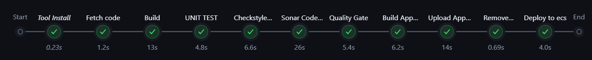

# Jenkins Configuration & Pipeline Setup

This guide covers setting up **Jenkins** after Vagrant provisioning: installing required plugins, configuring tools (JDK, Maven, Docker, SonarQube), adding AWS credentials for ECR, and creating the CI/CD pipeline.

Access Jenkins at: **http://192.168.33.13:8080**



## Initial Setup

1. Open Jenkins in your browser
2. Use the initial admin password (shown in `vagrant up` output or run inside VM):

```bash
sudo cat /var/lib/jenkins/secrets/initialAdminPassword
```

3. Install suggested plugins → create admin user → continue

## Install Required Plugins

Go to **Manage Jenkins → Plugins → Available** and install:

- **Docker Pipeline**
- **Amazon ECR** (or **Amazon Web Services SDK :: All**)
- **Pipeline: AWS Steps**
- **CloudBees Docker Build and Publish** (optional but helpful)
- **SonarQube Scanner**
- **Pipeline Maven Integration**
- **Slack Notification Plugin**
- **Build Timestamp Plugin** (optional)

Restart Jenkins if prompted.

## Configure Global Tools

**Manage Jenkins → Tools**

- **JDK**  
  Name: `JDK17`  
  Install automatically → Adoptium Temurin 17

- **Maven**  
  Name: `MAVEN3.9`  
  Install automatically → Apache Maven 3.9.x

- **SonarQube Scanner**  
  Name: `sonar6.2` (or latest compatible)  
  Install automatically

## Configure SonarQube Server

**Manage Jenkins → System → SonarQube servers**

- Name: `sonarserver`
- Server URL: `http://192.168.33.12`
- Server authentication token: (create in SonarQube → see [sonarqube.md](./sonarqube.md))

## Add AWS Credentials for ECR

**Manage Jenkins → Credentials → System → Global credentials**

Add new credential:

- Kind: **AWS Credentials**
- Access Key ID: Your IAM user's Access Key
- Secret Access Key: Corresponding Secret Key
- ID: `awscreds` (must match the Jenkinsfile)
- Description: AWS creds for ECR push

**Required IAM permissions** (attach to the user/role):
- `AmazonEC2ContainerRegistryFullAccess` (or minimal ECR push permissions)
- `AmazonECS_FullAccess` (if you plan to manage ECS later)

## Create the Pipeline Job

1. New Item → **Pipeline**
2. Name: e.g. `vprofile-cicd-ecs`
3. Pipeline definition: **Pipeline script from SCM** (recommended)
   - SCM: Git
   - Repository URL: your GitHub repo URL
   - Script Path: `scripts/Jenkinsfile`
4. Or paste the content directly for quick testing

The complete **Pipeline as Code** is located in:  
`scripts/Jenkinsfile`

## Pipeline Stages Explained (with Code Snippets)

The pipeline is declarative and uses the `Jenkinsfile` from the `scripts/` folder.

### 1. Tools & Environment Variables

```groovy
tools {
    maven "MAVEN3.9"
    jdk "JDK17"
}

environment {
    registryCredential = 'ecr:us-east-1:awscreds'
    appRegistry = "354918401592.dkr.ecr.us-east-1.amazonaws.com/app-rg"
    vprofileRegistry = "https://354918401592.dkr.ecr.us-east-1.amazonaws.com"
    cluster = "vprofile"
    service = "vprofile-app-task-service"
}
```

Defines Maven/JDK tools and ECR registry details (update account ID and repo name as needed).

### 2. Fetch Code

```groovy
stage('Fetch code') {
    steps {
        git branch: 'docker', url: 'https://github.com/hkhcoder/vprofile-project.git'
    }
}
```

Clones the `docker` branch containing the app and Dockerfile.

### 3. Build & Archive Artifact

```groovy
stage('Build'){
    steps{
        sh 'mvn install -DskipTests'
    }
    post {
        success {
            echo 'Now Archiving it...'
            archiveArtifacts artifacts: '**/target/*.war'
        }
    }
}
```

Builds the WAR file and archives it for later reference.

### 4. Unit Tests & Checkstyle

```groovy
stage('UNIT TEST') {
    steps{ sh 'mvn test' }
}

stage('Checkstyle Analysis') {
    steps{ sh 'mvn checkstyle:checkstyle' }
}
```

Runs JUnit tests and code style validation.

### 5. SonarQube Analysis + Quality Gate

```groovy
stage("Sonar Code Analysis") {
    environment {
        scannerHome = tool 'sonar6.2'
    }
    steps {
        withSonarQubeEnv('sonarserver') {
            sh '''${scannerHome}/bin/sonar-scanner \
                -Dsonar.projectKey=vprofile \
                -Dsonar.projectName=vprofile \
                ...'''
        }
    }
}

stage("Quality Gate") {
    steps {
        timeout(time: 1, unit: 'HOURS') {
            waitForQualityGate abortPipeline: true
        }
    }
}
```

Analyzes code quality and fails the build if the Quality Gate does not pass.

### 6. Build Docker Image

```groovy
stage('Build App Image') {
    steps {
        script {
            dockerImage = docker.build(appRegistry + ":$BUILD_NUMBER", "./Docker-files/app/multistage/")
        }
    }
}
```

Uses the multi-stage Dockerfile in `./Docker-files/app/multistage/` to create a lightweight Tomcat-based image.

### 7. Push to AWS ECR

```groovy
stage('Upload App Image') {
    steps{
        script {
            docker.withRegistry(vprofileRegistry, registryCredential) {
                dockerImage.push("$BUILD_NUMBER")
                dockerImage.push('latest')
            }
        }
    }
}
```

Authenticates using AWS credentials and pushes two tags: build number and `latest`.

### 8. Slack Notification

```groovy
post {
    always {
        echo 'Slack Notifications.'
        slackSend channel: '#all-m7md',
            color: COLOR_MAP[currentBuild.currentResult],
            message: "*${currentBuild.currentResult}:* Job ${env.JOB_NAME} build ${env.BUILD_NUMBER}\nMore info at: ${env.BUILD_URL}"
    }
}
```

Sends colored notification (green/red) to Slack on every build.

## Verification

- Run the pipeline → check console for ECR push success
- Go to AWS Console → ECR → `app-rg` repository → confirm new image tags
- Check Slack channel for notification
