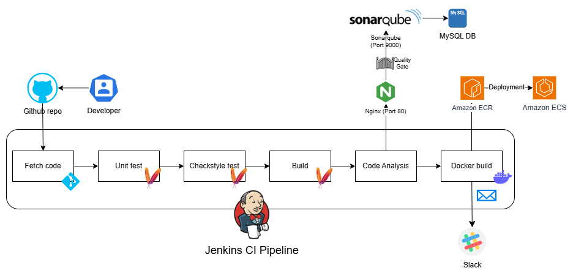

# Jenkins CI/CD Pipeline with Docker, ECR & ECS (Lab)

## Overview

This lab shows a realistic **CI/CD pipeline** for a Java web application using containerization and AWS services.

The pipeline automatically:

- Checks out code from GitHub
- Runs tests and quality checks
- Builds a production-ready Docker image
- Pushes the image to **AWS ECR**
- Notifies the team via Slack

After the image is in ECR, it is ready to be deployed to **AWS ECS** (manual or separate automated step).

### Workflow

1. Developer pushes code to GitHub (`docker` branch)
2. Jenkins starts the pipeline
3. Fetches the code
4. Runs **unit tests** (`mvn test`)
5. Runs **Checkstyle** analysis
6. Builds the WAR artifact
7. Performs **SonarQube** analysis + enforces Quality Gate
8. Builds multi-stage **Docker** image
9. Logs in to **AWS ECR** and pushes the image (build number + `latest` tags)
10. Sends **Slack** notification (success / failure)

**Deployment to ECS** is prepared but **not automated** in this pipeline (typical pattern: separate CD trigger, blue/green deployment, or GitOps).

### Tools & Technologies

| Tool            | Purpose                              | Why it's used                              |
|-----------------|--------------------------------------|--------------------------------------------|
| Jenkins         | Orchestrates the entire CI/CD flow   | Flexible Pipeline as Code + great plugins  |
| Maven           | Build, test, dependency management   | Standard for Java WAR projects             |
| SonarQube       | Code quality & security analysis     | Enforces standards before container build  |
| Docker          | Builds container image               | Modern, portable deployment format         |
| AWS ECR         | Private container registry           | Secure, integrated with AWS ecosystem      |
| AWS ECS         | Runs containers in production        | Managed container orchestration            |
| Vagrant         | Provisions Jenkins & SonarQube VMs   | Easy local/reproducible environment        |
| Slack           | Real-time build notifications        | Quick team visibility                      |

### Access After Provisioning

| Service       | URL                                   | Default / Notes                          |
|---------------|---------------------------------------|------------------------------------------|
| Jenkins       | http://192.168.33.13:8080            | Initial password shown during setup      |
| SonarQube     | http://192.168.33.12                 | admin / admin → change immediately       |

### Prerequisites

- Vagrant + VirtualBox (for Jenkins & SonarQube)
- AWS account with permissions for:
  - ECR (create repository, push images)
  - ECS (cluster, task definition, service)
  - IAM (user/role with ECR + ECS access)
- AWS CLI & Docker installed on Jenkins VM (handled in provisioning + post-steps)

### Quick Start

1. Provision VMs → [vagrant.md](./vagrant.md)
2. Configure Jenkins (plugins, tools, AWS credentials) → [jenkins.md](./jenkins.md)
3. Set up SonarQube project & token → [sonarqube.md](./sonarqube.md)
4. Create ECR repository → [ecr.md](./ecr.md)
5. Prepare ECS cluster/service/task definition → [ecs.md](./ecs.md)
6. Run the pipeline → watch image appear in ECR

All scripts and the Jenkinsfile are in the `scripts/` folder.

Happy building & deploying containers! 🚀
