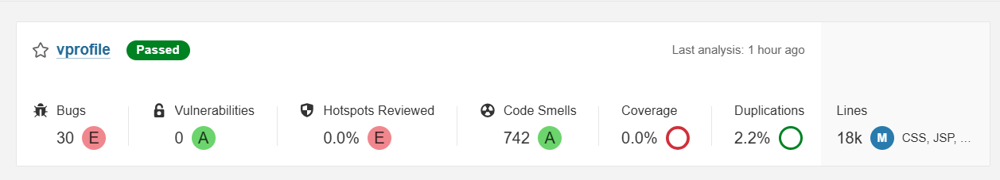

# SonarQube Setup & Configuration

This guide explains how to access **SonarQube**, perform initial login, change default credentials, create the project used in the pipeline (`vprofile`), generate an authentication token, and verify analysis results after a pipeline run.

SonarQube is accessible at: **http://192.168.33.12** (served via Nginx on port 80)



## Initial Access & Login

1. Open your browser and go to:  
   http://192.168.33.12

2. Log in with default credentials:
   - **Username**: `admin`
   - **Password**: `admin`

3. You will be forced to change the password immediately.
   - Choose a strong password (e.g., `admin123` or better) and confirm.

## Create the Project

1. After login, click **Create Project** → **Manually**
2. Fill in:
   - **Project key**: `vprofile`
   - **Display name**: `vprofile` (or any friendly name)
   - **Main branch name**: `docker` (matches the branch used in Jenkinsfile)
3. Click **Set Up**
4. Choose **Locally** (we use SonarScanner in Jenkins)
5. SonarQube will show example commands — the pipeline already uses similar parameters:

```bash
sonar-scanner \
  -Dsonar.projectKey=vprofile \
  -Dsonar.sources=src/ \
  -Dsonar.host.url=http://192.168.33.12 \
  -Dsonar.login=<your-token>
```

## Generate Authentication Token for Jenkins

1. Click your avatar (top-right) → **My Account** → **Security** tab
2. Under **Generate Tokens**:
   - Enter name: e.g. `jenkins-pipeline-token`
   - Click **Generate**
3. **Copy the token immediately** — it won't be shown again.

### Add Token to Jenkins

Two common options:

**Option A: Use SonarQube Server Configuration (Recommended)**  
- In Jenkins: **Manage Jenkins → System → SonarQube servers**  
- Edit `sonarserver`  
- Under **Server authentication token**, select **Add** → **Jenkins** → paste the token as **Secret text**  
- Credential ID can be auto-generated or set manually

**Option B: Manual Secret Text Credential**  
- **Manage Jenkins → Credentials → System → Global credentials**  
- Add → **Secret text**  
  - Secret: paste the SonarQube token  
  - ID: e.g. `sonarqube-token`  
- Then reference it in Jenkinsfile if needed (not required here since `withSonarQubeEnv` uses the server config)

## Quality Gate

The pipeline includes:

```groovy
stage("Quality Gate") {
    steps {
        timeout(time: 1, unit: 'HOURS') {
            waitForQualityGate abortPipeline: true
        }
    }
}
```

This step:
- Waits for SonarQube analysis to complete
- Checks the Quality Gate status
- Fails the entire pipeline if gate is **ERROR** or **WARN** (default Sonar way gate)

To customize the Quality Gate:
1. Go to **Quality Gates** (left menu)
2. Edit **Sonar way** (default) or create a new one
3. Set conditions (e.g., Coverage on new code ≥ 80%, No new critical issues, etc.)

## Verification After Pipeline Run

1. Trigger the Jenkins pipeline
2. Wait for **Sonar Code Analysis** and **Quality Gate** stages to complete
3. Go back to SonarQube dashboard → search for project `vprofile`
4. Check:
   - Bugs, Vulnerabilities, Code Smells
   - Coverage percentage
   - Duplications
   - Quality Gate status (should be **Passed** on success)
